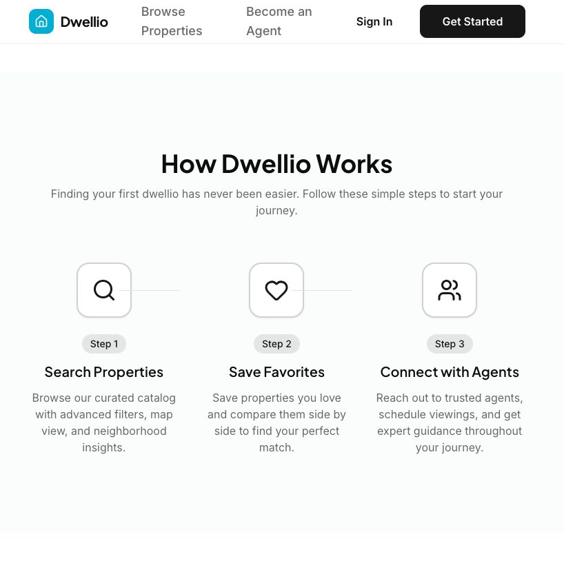
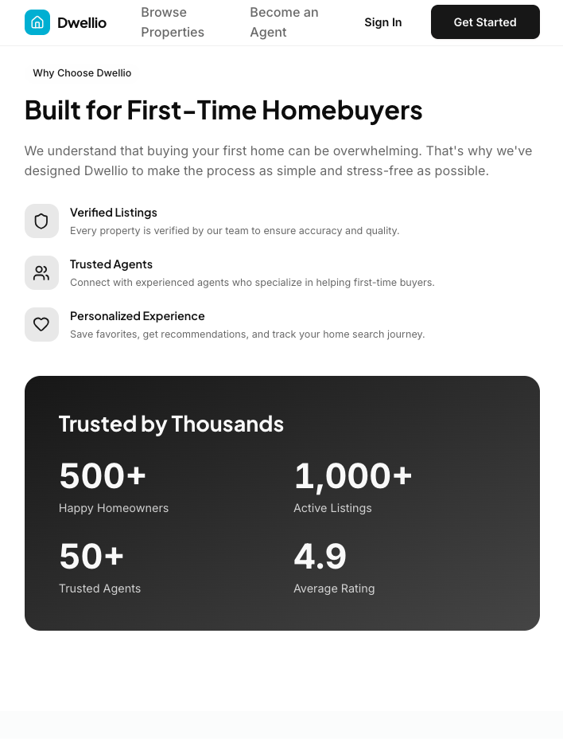
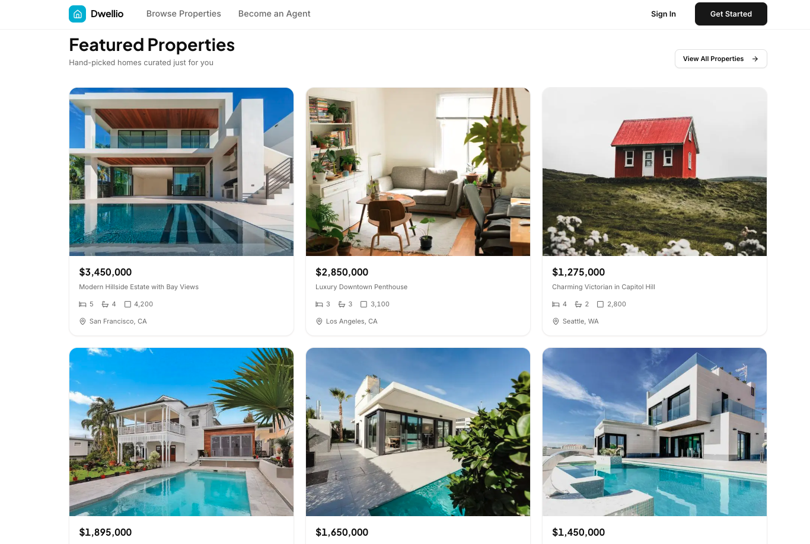
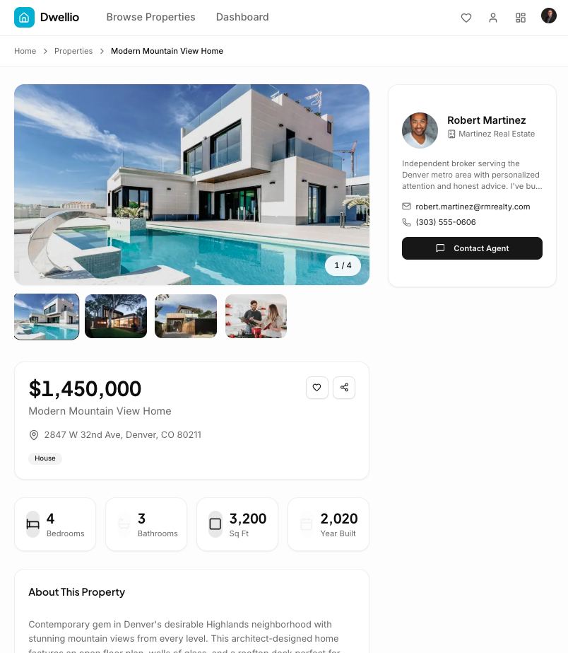
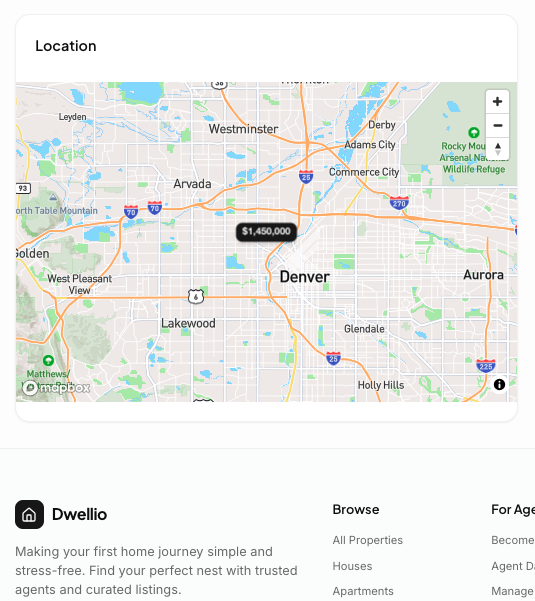

# 🏡 Dwellio – Modern Real Estate Platform


Dwellio is a modern real estate platform designed to make buying your first home simple and stress-free.

It provides a clean, intuitive property search experience for homebuyers and a powerful listing and lead management dashboard for real estate agents.

---

## 🖼️ Screenshots

### 🏠 Hero & First Impression
| Landing Page |
|-------------|
|  |

### ⚙️ How It Works
| Process Overview |
|------------------|
|  |

### ⭐ Why Dwellio
| Value Proposition |
|-------------------|
|  |

### 🏘️ Property Discovery
| Featured Listings |
|-------------------|
|  |

### 📄 Property Details
| Listing Page |
|--------------|
|  |

### 🗺️ Interactive Map
| Map View |
|----------|
|  |

---

## 🎯 Who Is This For?

**First-time homebuyers**
- Clean, simple property search
- Real-time listings and maps
- Save favorites and contact agents

**Real estate agents**
- List and manage properties
- Track leads and analytics
- Manage subscriptions and profile

---

## ⚡ What Problem Does It Solve?

Traditional real estate platforms are cluttered and overwhelming.

**Dwellio focuses on:**
- Clean, modern UI
- Real-time content updates
- Interactive map-based search
- Seamless agent subscription system

---

## 🔥 Technical Highlights

- Real-time content with **Sanity Live**
- **Sanity Studio** as a built-in admin dashboard
- **Clerk Billing** integration (no webhooks required)
- Interactive **Mapbox** maps with markers
- Type-safe schemas with auto-generated TypeScript
- Server Actions + Server Components
- React 19 + React Compiler optimizations

---

## ✨ Features

### For Homebuyers (Free)

| Feature | Description |
|--------|-------------|
| 🔍 Advanced Search | Filter by price, beds, baths, type, and amenities |
| 🗺️ Interactive Map | View properties with Mapbox price markers |
| 💾 Save Favorites | Build a list of saved properties |
| 📧 Contact Agents | Message listing agents directly |
| 🖼️ Image Galleries | Browse high-quality photos |
| 📱 Responsive Design | Works across all devices |

---

### For Real Estate Agents ($29/month)

| Feature | Description |
|--------|-------------|
| 📊 Analytics Dashboard | Track views, leads, and performance |
| 🏠 Unlimited Listings | Create and manage properties |
| 📬 Lead Inbox | Manage buyer inquiries |
| 📍 Address Autocomplete | Mapbox-powered geocoding |
| ✏️ Listing Management | Update status and details |
| 👤 Professional Profile | Showcase credentials and bio |
| 💳 Billing Management | Subscription via Clerk |

---

### Technical Features

| Feature | Why It Matters |
|--------|----------------|
| 🔄 Real-Time Updates | Sanity Live pushes changes instantly |
| 🎛️ Sanity Studio | Admin dashboard at `/studio` |
| 📐 Schema + Typegen | Auto-generate TypeScript types |
| 💳 Clerk Billing | Subscription management without webhooks |
| 🗄️ Type-Safe Queries | GROQ with generated types |
| ⚙️ Server Actions | Secure server-side form handling |
| 🎨 React 19 + Compiler | Automatic performance optimizations |
| 📍 Geocoding | Mapbox address autocomplete |
| 📈 Analytics Charts | Recharts data visualization |

---

## 🧰 Tech Stack

- **Framework:** Next.js (App Router)
- **Frontend:** React 19, Tailwind CSS, Radix UI
- **Auth & Billing:** Clerk
- **CMS:** Sanity
- **Maps & Geocoding:** Mapbox
- **Type Safety:** TypeScript + Zod
- **Charts:** Recharts

---

## 🚀 Getting Started

### Prerequisites
- Node.js 20+
- pnpm or npm
- Clerk account with Billing
- Sanity project
- Mapbox access token

---

### 1. Clone the Repository

```bash
git clone https://github.com/your-username/nestwell.git
cd nestwell
```

### 2. Install Dependencies

```bash
pnpm install
```

### 3. Set Up Environment Variables

Create a `.env.local` file:

```env
# Clerk
NEXT_PUBLIC_CLERK_PUBLISHABLE_KEY=pk_test_xxxxx
CLERK_SECRET_KEY=sk_test_xxxxx
NEXT_PUBLIC_CLERK_SIGN_IN_URL=/sign-in
NEXT_PUBLIC_CLERK_SIGN_UP_URL=/sign-up

# Sanity
NEXT_PUBLIC_SANITY_PROJECT_ID=your-project-id
NEXT_PUBLIC_SANITY_DATASET=production
SANITY_API_TOKEN=your-write-token

# Mapbox
NEXT_PUBLIC_MAPBOX_TOKEN=pk.xxxxx
MAPBOX_ACCESS_TOKEN=pk.xxxxx

# App URL
NEXT_PUBLIC_APP_URL=http://localhost:3000
```

⚠️ Never commit `.env.local` to version control.

---

### 4. Generate Types

```bash
pnpm typegen
```

---

### 5. Run the Development Server

```bash
pnpm dev
```

Open:

```
http://localhost:3000
```

---

### 6. Access Sanity Studio

```
http://localhost:3000/studio
```

Manage:
- Properties
- Agents
- Leads
- Amenities

---

## 🗄️ Database Schema Overview

| Collection | Purpose |
|-----------|---------|
| property | Property listings |
| agent | Agent profiles |
| user | Homebuyer profiles |
| lead | Buyer inquiries |
| amenity | Property amenities |

---

## 🚢 Deployment

### Vercel CLI

```bash
pnpm i -g vercel
vercel
```

### GitHub Integration

1. Push to GitHub
2. Import into Vercel
3. Add environment variables
4. Deploy

---

## ❓ Common Issues

| Problem | Solution |
|--------|----------|
| Sanity project undefined | Check `.env.local` |
| Types not generating | Run `pnpm typegen` |
| Maps not showing | Verify Mapbox token |
| Billing not working | Enable in Clerk Dashboard |
| No properties visible | Run `pnpm seed` |

---

## 📄 License

MIT License — feel free to use, modify, and build on top of this project.

---
## 👨‍💻 Author

**Robert Johnson**  
Full-Stack & AI Engineer  
GitHub: https://github.com/johnsonr84

**Built with precision by Rob Johnson**  
_Engineering modern SaaS products with real-world complexity._